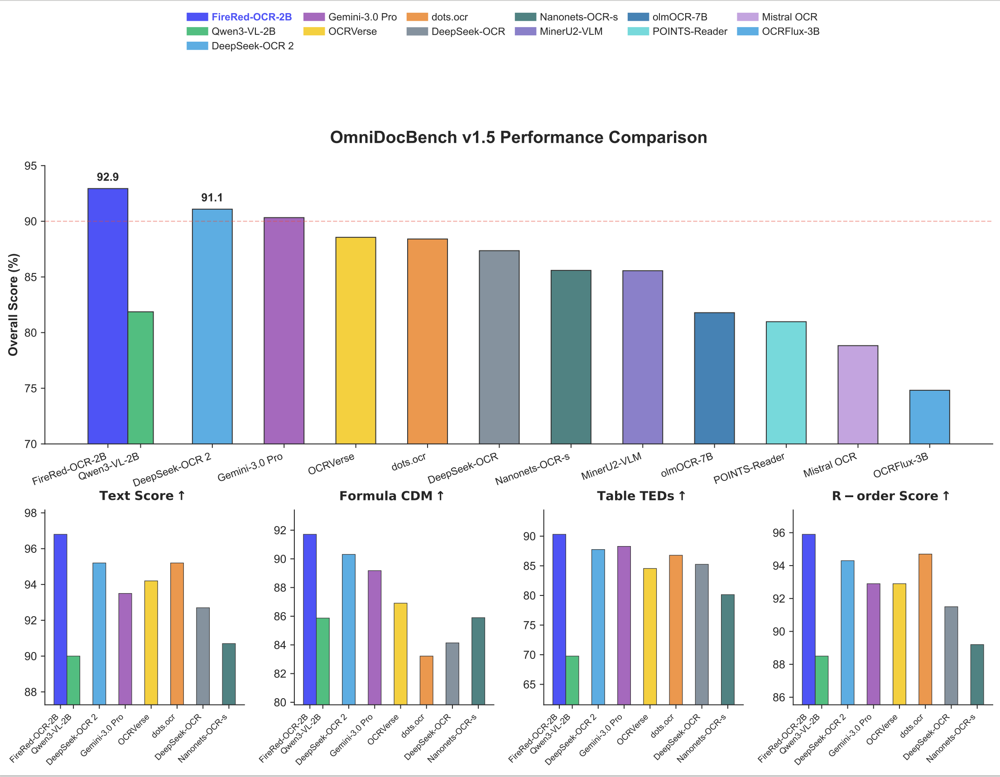
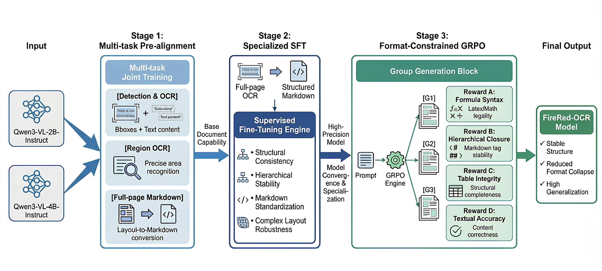

<p align="center">
  
</p>

<p align="center" style="line-height: 1;">
  <a href="https://huggingface.co/FireRedTeam" target="_blank"></a>
  <a href="https://huggingface.co/FireRedTeam/FireRed-OCR" target="_blank"></a>
  <a href="https://huggingface.co/spaces/FireRedTeam/FireRed-OCR" target="_blank"></a>
</p>

<p align="center" style="line-height: 1;">
  🤗 <a href="https://huggingface.co/FireRedTeam/FireRed-OCR">HuggingFace</a> |
  🖥️ <a href="https://huggingface.co/spaces/FireRedTeam/FireRed-OCR"> Demo</a> |
  📄 <a href="https://github.com/FireRedTeam/FireRed-OCR/blob/main/assets/FireRed_OCR_Technical_Report.pdf">Technical Report</a> | 
  🐈 <a href="https://github.com/FireRedTeam/FireRed-OCR">GitHub</a>
</p>

<p align="center">
  
  <br>
  <em>Figure 1: Performance comparison on the OmniDocBench v1.5 benchmark. FireRed-OCR achieves state-of-the-art performance among end-to-end solutions, ranking first with a score above 92%.</em>
</p>

## 🔥 FireRed-OCR

**FireRed-OCR** is a systematic framework designed to specialize general Large Vision-Language Models (LVLMs) into high-performance, pixel-precise structural document parsing experts.  

General VLMs frequently suffer from **"Structural Hallucination"** (e.g., disordered rows, invented formulas) when processing complex documents. FireRed-OCR addresses this by shifting the paradigm from "impressionist" text generation to "structural engineering," achieving State-of-the-Art (SOTA) results on authoritative benchmarks like OmniDocBench v1.5.

## ✨ Key Features

- **SOTA Performance**: Achieves **92.94%** overall score on OmniDocBench v1.5, significantly outperforming DeepSeek-OCR 2, OCRVerse, and massive general VLMs (e.g., Gemini-3.0 Pro，Qwen3-VL-235B).
- **Structural Integrity**: Utilizing **Format-Constrained GRPO** (Group Relative Policy Optimization), the model enforces strict syntactic validity, eliminating common errors like unclosed tables or invalid LaTeX formulas.
- **"Geometry + Semantics" Data Factory**: A novel data engine that uses geometric feature clustering and multi-dimensional tagging to synthesize balanced datasets, effectively handling long-tail layouts.
- **Progressive Training Pipeline**: 
    1.  **Multi-task Pre-alignment**: Establishes spatial grounding.
    2.  **Specialized SFT**: Standardizes full-image Markdown output.
    3.  **Format-Constrained GRPO**: Self-correction via Reinforcement Learning.
- **In-the-Wild Robustness**: Demonstrates superior resilience on complex, non-standard layouts (FireRedBench) compared to traditional pipeline systems like PaddleOCR.

## 📰 News
- **2026.02.28**: We released FireRed-OCR-2B weights. Check more details in the [Model Zoo](#-model-zoo) section.

## 🗂️ Model Zoo

<div style="overflow-x: auto; margin-bottom: 16px;">
<table style="border-collapse: collapse; width: 100%;">
<thead>
<tr>
<th style="white-space: nowrap; padding: 8px; border: 1px solid #d0d7de; background-color: #f6f8fa;">Models</th>
<th style="white-space: nowrap; padding: 8px; border: 1px solid #d0d7de; background-color: #f6f8fa;">Base</th>
<th style="padding: 8px; border: 1px solid #d0d7de; background-color: #f6f8fa;">Description</th>
<th style="padding: 8px; border: 1px solid #d0d7de; background-color: #f6f8fa;">Download Link</th>
</tr>
</thead>
<tbody>
<tr>
<td style="white-space: nowrap; padding: 8px; border: 1px solid #d0d7de;">FireRed-OCR-2B</td>
<td style="white-space: nowrap; padding: 8px; border: 1px solid #d0d7de;">Qwen3-VL-2B-Instruct</td>
<td style="padding: 8px; border: 1px solid #d0d7de;">Lightweight version achieving 92.94% Overall on OmniDocBench v1.5.</td>
<td style="padding: 8px; border: 1px solid #d0d7de;">
<span style="white-space: nowrap;">🤗&nbsp;<a href="https://huggingface.co/FireRedTeam/FireRed-OCR">HuggingFace</a></span>
</td>
</tr>
</tbody>
</table>
</div>

## 🏗️ Model Architecture

The FireRed-OCR framework transforms a general VLM into a structural expert through a three-stage progressive training strategy:

1.  **Stage 1: Multi-task Pre-alignment**: Trains the model on detection, region recognition, and layout-to-markdown tasks to ground visual perception.
2.  **Stage 2: Specialized SFT**: Fine-tunes on a high-quality, standardized Markdown dataset to ensure logical consistency and hierarchical expression.
3.  **Stage 3: Format-Constrained GRPO**: Applies Reinforcement Learning with specific rewards for **Formula Syntax**, **Table Integrity**, **Hierarchical Closure**, and **Text Accuracy**.

<p align="center">
  
</p>

## ⚡️ Quick Start

FireRed-OCR is based on the Qwen3-VL architecture. You can use the following code snippets to generate structured Markdown from document images.

**1. Install Dependencies**
```bash
pip install transformers
pip install qwen-vl-utils
git clone https://github.com/FireRedTeam/FireRed-OCR.git
cd FireRed-OCR
```

**2. Inference**
```python
from transformers import Qwen3VLForConditionalGeneration, AutoProcessor
from conv_for_infer import generate_conv

# Load the model
model = Qwen3VLForConditionalGeneration.from_pretrained(
    "FireRedTeam/FireRed-OCR-2B",
    torch_dtype=torch.bfloat16,
    device_map="auto",
)

# We recommend enabling flash_attention_2 for better acceleration and memory saving, especially in multi-image and video scenarios.
# model = Qwen3VLForConditionalGeneration.from_pretrained(
#     "Qwen/FireRed-OCR-2B,
#     dtype=torch.bfloat16,
#     attn_implementation="flash_attention_2",
#     device_map="auto",
# )

processor = AutoProcessor.from_pretrained("FireRedTeam/FireRed-OCR-2B")

# Prepare Input
image_path = "./examples/complex_table.png"
messages = generate_conv(image_path)

# Preparation for inference
inputs = processor.apply_chat_template(
    messages,
    tokenize=True,
    add_generation_prompt=True,
    return_dict=True,
    return_tensors="pt"
)
inputs = inputs.to(model.device)

# Inference: Generation of the output
generated_ids = model.generate(**inputs, max_new_tokens=8192)
generated_ids_trimmed = [
    out_ids[len(in_ids) :] for in_ids, out_ids in zip(inputs.input_ids, generated_ids)
]
output_text = processor.batch_decode(
    generated_ids_trimmed, skip_special_tokens=True, clean_up_tokenization_spaces=False
)
print(output_text)
```

## 📊 Benchmark

We evaluate FireRed-OCR on **OmniDocBench v1.5** and **FireRedBench**.

### OmniDocBench v1.5

<table>
  <thead>
    <tr>
      <th>Model</th>
      <th>Overall ↑</th>
      <th>Text<sup>Edit</sup> ↓</th>
      <th>Formula<sup>CDM</sup> ↑</th>
      <th>Table<sup>TEDs</sup> ↑</th>
      <th>Table<sup>TEDS_s</sup> ↑</th>
      <th>R-order<sup>Edit</sup> ↓</th>
    </tr>
  </thead>
  <tbody>
    <tr>
      <td colspan="7" align="center"><strong>Pipeline</strong></td>
    </tr>
    <tr><td>Dolphin</td><td>74.67</td><td>0.125</td><td>67.85</td><td>68.70</td><td>77.77</td><td>0.124</td></tr>
    <tr><td>Dolphin-1.5</td><td>83.21</td><td>0.092</td><td>80.78</td><td>78.06</td><td>84.10</td><td>0.080</td></tr>
    <tr><td>PP-StructureV3</td><td>86.73</td><td>0.073</td><td>85.79</td><td>81.68</td><td>89.48</td><td>0.073</td></tr>
    <tr><td>MonkeyOCR-pro-1.2B</td><td>86.96</td><td>0.084</td><td>85.02</td><td>84.24</td><td>89.02</td><td>0.130</td></tr>
    <tr><td>MonkeyOCR-3B</td><td>87.13</td><td>0.075</td><td>87.45</td><td>81.39</td><td>85.92</td><td>0.129</td></tr>
    <tr><td>MonkeyOCR-pro-3B</td><td>88.85</td><td>0.075</td><td>87.25</td><td>86.78</td><td>90.63</td><td>0.128</td></tr>
    <tr><td>MinerU2.5</td><td>90.67</td><td>0.047</td><td>88.46</td><td>88.22</td><td>92.38</td><td>0.044</td></tr>
    <tr><td>PaddleOCR-VL</td><td>92.86</td><td>0.035</td><td>91.22</td><td>90.89</td><td>94.76</td><td>0.043</td></tr>
    <tr><td>PaddleOCR-VL-1.5</td><td>94.50</td><td>0.035</td><td>94.21</td><td>92.76</td><td>95.79</td><td>0.042</td></tr>
    <tr><td><strong>GLM-OCR</strong></td><td><strong>94.60</strong></td><td>-</td><td>-</td><td>-</td><td>-</td><td>-</td></tr>
    <tr>
      <td colspan="7" align="center"><strong>End-to-end</strong></td>
    </tr>
    <tr><td>OCRFlux-3B</td><td>74.82</td><td>0.193</td><td>68.03</td><td>75.75</td><td>80.23</td><td>0.202</td></tr>
    <tr><td>Mistral OCR</td><td>78.83</td><td>0.164</td><td>82.84</td><td>70.03</td><td>78.04</td><td>0.144</td></tr>
    <tr><td>InternVL3-76B</td><td>80.33</td><td>0.131</td><td>83.42</td><td>70.64</td><td>77.74</td><td>0.113</td></tr>
    <tr><td>POINTS-Reader</td><td>80.98</td><td>0.134</td><td>79.20</td><td>77.13</td><td>81.66</td><td>0.145</td></tr>
    <tr><td>olmOCR-7B</td><td>81.79</td><td>0.096</td><td>86.04</td><td>68.92</td><td>74.77</td><td>0.121</td></tr>
    <tr><td>Qwen3-VL-2B</td><td>81.87</td><td>0.100</td><td>85.87</td><td>69.77</td><td>74.37</td><td>0.115</td></tr>
    <tr><td>InternVL3.5-241B</td><td>82.67</td><td>0.142</td><td>87.23</td><td>75.00</td><td>81.28</td><td>0.125</td></tr>
    <tr><td>GPT-5.2</td><td>85.50</td><td>0.123</td><td>86.11</td><td>82.66</td><td>87.35</td><td>0.099</td></tr>
    <tr><td>MinerU2-VLM</td><td>85.56</td><td>0.078</td><td>80.95</td><td>83.54</td><td>87.66</td><td>0.086</td></tr>
    <tr><td>Nanonets-OCR-s</td><td>85.59</td><td>0.093</td><td>85.90</td><td>80.14</td><td>85.57</td><td>0.108</td></tr>
    <tr><td>Qwen2.5-VL-72B</td><td>87.02</td><td>0.094</td><td>88.27</td><td>82.15</td><td>86.22</td><td>0.102</td></tr>
    <tr><td>DeepSeek-OCR</td><td>87.36</td><td>0.073</td><td>84.14</td><td>85.25</td><td>89.01</td><td>0.085</td></tr>
    <tr><td>dots.ocr</td><td>88.41</td><td>0.048</td><td>83.22</td><td>86.78</td><td>90.62</td><td>0.053</td></tr>
    <tr><td>OCRVerse</td><td>88.56</td><td>0.058</td><td>86.91</td><td>84.55</td><td>88.45</td><td>0.071</td></tr>
    <tr><td>Qwen3-VL-235B-A22B</td><td>89.15</td><td>0.069</td><td>88.14</td><td>86.21</td><td>90.55</td><td>0.068</td></tr>
    <tr><td>Gemini-3.0 Pro</td><td>90.33</td><td>0.065</td><td>89.18</td><td>88.28</td><td>90.29</td><td>0.071</td></tr>
    <tr><td>Qwen3.5-397B-A17B</td><td>90.80</td><td>-</td><td>-</td><td>-</td><td>-</td><td>-</td></tr>
    <tr><td>DeepSeek-OCR 2</td><td>91.09</td><td>0.048</td><td>90.31</td><td>87.75</td><td>92.06</td><td>0.057</td></tr>
    <tr><td><strong>FireRed-OCR-2B</strong></td><td><strong>92.94</strong></td><td><strong>0.032</strong></td><td><strong>91.71</strong></td><td><strong>90.31</strong></td><td><strong>93.81</strong></td><td><strong>0.041</strong></td></tr>
  </tbody>
</table>

### FireRedBench

<table>
  <thead>
    <tr>
      <th>Model</th>
      <th>Overall ↑</th>
      <th>Text<sup>Edit</sup> ↓</th>
      <th>Formula<sup>CDM</sup> ↑</th>
      <th>Table<sup>TEDs</sup> ↑</th>
      <th>Table<sup>TEDS_s</sup> ↑</th>
      <th>R-order<sup>Edit</sup> ↓</th>
    </tr>
  </thead>
  <tbody>
    <tr><td>GPT-5.2🔒</td><td>68.09</td><td>0.238</td><td>66.33</td><td>61.74</td><td>68.00</td><td>0.380</td></tr>
    <tr><td>Gemini-3.0 Pro🔒</td><td>79.68</td><td>0.169</td><td>80.11</td><td>75.82</td><td>82.73</td><td>0.353</td></tr>
    <tr>
      <td colspan="7" align="center"><strong>Pipeline</strong></td>
    </tr>
    <tr><td>GLM-OCR</td><td>74.33</td><td>0.309</td><td>82.53</td><td>71.35</td><td>79.93</td><td>0.456</td></tr>
    <tr><td><strong>PaddleOCR-VL-1.5</strong></td><td><strong>76.47</strong></td><td>0.291</td><td>92.37</td><td>66.15</td><td>74.39</td><td>0.453</td></tr>
    <tr>
      <td colspan="7" align="center"><strong>End-to-end</strong></td>
    </tr>
    <tr><td>DeepSeek-OCR 2</td><td>61.61</td><td>0.290</td><td>58.78</td><td>55.06</td><td>59.42</td><td>0.437</td></tr>
    <tr><td>dots.ocr</td><td>72.93</td><td>0.240</td><td>82.53</td><td>60.25</td><td>64.08</td><td>0.419</td></tr>
    <tr><td>Qwen3-VL-2B-Instruct</td><td>65.58</td><td>0.283</td><td>75.19</td><td>49.85</td><td>55.66</td><td>0.388</td></tr>
    <tr><td><strong>FireRed-OCR-2B</strong></td><td><strong>74.62</strong></td><td>0.248</td><td>83.02</td><td>65.63</td><td>72.30</td><td>0.430</td></tr>
  </tbody>
</table>

### Additional Benchmarks

<table>
  <thead>
    <tr>
      <th>Model</th>
      <th>OmniDocBench v1.5</th>
      <th>FireRedBench</th>
      <th>OCRBench(TextRec)</th>
      <th>TEDS_TEST</th>
      <th>PubTabNet</th>
    </tr>
  </thead>
  <tbody>
    <tr>
      <td>GPT-5.2🔒</td>
      <td>85.50</td>
      <td>68.09</td>
      <td>93.0</td>
      <td>67.6</td>
      <td>84.4</td>
    </tr>
    <tr>
      <td>Gemini-3.0 Pro🔒</td>
      <td>90.33</td>
      <td>79.68</td>
      <td>91.9</td>
      <td>81.8</td>
      <td>91.4</td>
    </tr>
    <tr>
      <td colspan="6" align="center"><strong>Pipeline</strong></td>
    </tr>
    <tr>
      <td>MinerU2.5</td>
      <td>90.67</td>
      <td>-</td>
      <td>-</td>
      <td>85.4</td>
      <td>88.4</td>
    </tr>
    <tr>
      <td>PaddleOCR-VL-1.5</td>
      <td>94.50</td>
      <td>76.47</td>
      <td>53.5 / 87.0</td>
      <td>83.3</td>
      <td>84.6</td>
    </tr>
    <tr>
      <td>GLM-OCR</td>
      <td>94.60</td>
      <td>74.33</td>
      <td>61.0 / 95.0</td>
      <td>86.0</td>
      <td>85.2</td>
    </tr>
    <tr>
      <td colspan="6" align="center"><strong>End-to-end</strong></td>
    </tr>
    <tr>
      <td>dots.ocr</td>
      <td>88.41</td>
      <td>72.93</td>
      <td>92.1</td>
      <td>62.4</td>
      <td>71.0</td>
    </tr>
    <tr>
      <td>DeepSeek-OCR 2</td>
      <td>91.09</td>
      <td>61.61</td>
      <td>48.5</td>
      <td>-</td>
      <td>-</td>
    </tr>
    <tr>
      <td><strong>FireRed-OCR-2B</strong></td>
      <td><strong>92.94</strong></td>
      <td><strong>74.62</strong></td>
      <td><strong>93.5</strong></td>
      <td><strong>80.6</strong></td>
      <td><strong>77.0</strong></td>
    </tr>
  </tbody>
</table>

> For PaddleOCR-VL-1.5 and GLM-OCR on OCRBench, scores are reported as API / pure VLM.

## 📜 License Agreement

The code and the weights of FireRed-OCR are licensed under Apache 2.0.

## 🖊️ Citation

We kindly encourage citation of our work if you find it useful.

```bibtex
@article{fireredocr,
  title={FireRed-OCR Technical Report},
  author={Super Intelligence Team， Xiaohongshu Inc.},
  year={202X},
  archivePrefix={arXiv},
  primaryClass={cs.CV},
  url={https://github.com/FireRedTeam/FireRed-OCR}
}
```

## ⚠️ Ethics Statement

FireRed-OCR is a technical tool designed for document digitization and structural parsing.

- **Prohibited Use**: This project must not be used to generate or process content that is illegal, defamatory, pornographic, harmful, or that violates the privacy, rights, or interests of individuals or organizations.
- **User Responsibility**: Users are solely responsible for any content generated using this project. The authors and contributors assume no responsibility or liability for any misuse of the codebase or for any consequences resulting from its use.

## 🤝 Acknowledgements

We would like to thank the developers of the amazing open-source projects, including [Qwen-VL](https://github.com/QwenLM/Qwen-VL), [PaddleOCR](https://github.com/PaddlePaddle/PaddleOCR), [olmOCR](https://github.com/allenai/olmocr) and the broader OCR community.

## ⭐ Star History

[](https://www.star-history.com/#FireRedTeam/FireRed-OCR&type=date&legend=top-left)
```